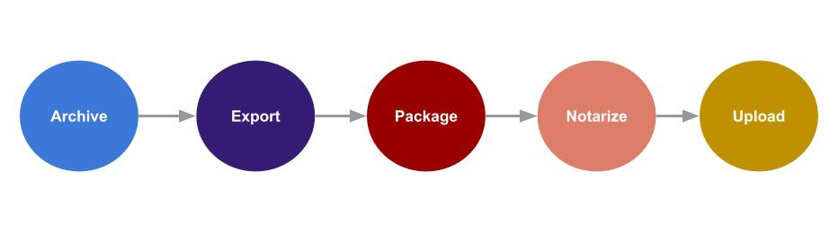

# autosparkle




autosparkle simplifies the process of **archiving**, **exporting**, **signing**, **packaging**, **notarizing**, and **uploading** your new version of the macOS app outside the App Store.

With autosparkle, you no longer have to worry about these steps anymore.

## Table of Contents
- [Introduction](#introduction)
- [Features](#features)
- [Installation](#installation)
- [Environment](#environment)
- [Storage](#storage)
- [Future Enhancements](#future-enhancements)
- [Contributing](#contributing)
- [License](#license)

## Introduction

Pushing a new version of your macOS application outside the App Store can be time-consuming. This is because there are several steps required by Apple, in addition to the ones related to Sparkle.

autosparkle is a Ruby command line tool that automates the delivery of your macOS applications outside the App Store. It is implemented around the [Sparkle](https://github.com/sparkle-project/Sparkle) framework.

> **Note:**
>
> *This tool is designed for use in a Continuous Delivery (CD) workflow. Although it is possible to run it locally, doing so is not recommended due to the creation of a custom keychain and the mounting of a new DMG. However, if you are comfortable with these steps, you can run it locally without any issues.*

## Features
- Archive and export your signed application using the provided Developer Application ID certificate.
- Package your app into a signed DMG.
- Customize your DMG appearance by adding a custom background image and a symbolic link to drag the app to the Applications folder.
- Notarize and staple your DMG.
- Automatically sign the Sparkle framework.
- Automatically handle your app versioning based on the specified bump method and the versions uploaded to the storage.
- Generate or update the appcast.xml file used by Sparkle.
- Upload the appcast.xml and your new version to the specified storage.
- Use environment files, making it easy to create a specific one for use in CD *(e.g., env.autosparkle.production)*.

## Installation

#### Using Ruby Gems:
1. Run the following command:
    ```bash
    gem install autosparkle
    ```
2. (optional) Add autosparkle to your shell configuration file (e.g. ~/.bashrc or  ~/.zshrc) by appending the following line:
    ```bash
    export PATH="<<YOUR_GEMS_DIR>>/autosparkle-x.x.x/bin:$PATH"
    ```
    Make sure to replace `<<YOUR_GEMS_DIR>>/autosparkle-x.x.x` with the actual path to the autosparkle gem on your system.

3. (optional) Run the following command: `source ~/.bashrc` or `source ~/.zshrc`.


#### Manual install:

1. Clone the repository:
   ```bash
   git clone https://github.com/hadiidbouk/autosparkle.git
   ```
2. Call the `autosparkle.rb` script from the repository, you need to specify your Xcode project path and your environment file. Here's how you can do it:
    ```bash
    ruby autosparkle.rb --project-path <<YOUR XCODE PROJECT>> --env <<YOUR ENV NAME>>
    ```

    You can also pass your workspace path using `--workspace-path` and specify the environment path using `--env-file`.


## Environment
autosparkle utilizes the [dotenv](https://github.com/bkeepers/dotenv) gem to manage environment variables.

The purpose of using environment variable files is to facilitate the transition between the local environment on your personal machine and the production environment on your continuous delivery machine.

When you specify the environment name using the `--env` command, autosparkle will search for autosparkle environment files *(e.g., .env.autosparkle.local, .env.autosparkle.production)* in your project directory.

Remember to add your local environment file to the *.gitignore* file and remove any sensitive data from your production environment file. Instead, replace them with the environment variables provided by your continuous delivery system like this:
```
APP_SEPECIFIC_PASSWORD=$APP_SPECIFIC_PASSWORD
```

Below are the list of environment variables used by autosparkle:

| Variable | Description | Required | Default value |
|----------|-------------|----------|---------------|
| SCHEME | The macOS app scheme | Yes | |
| CONFIGURATION | The app configuration (Debug/Release..)| Yes | |
| APPLE_ID | The Apple ID that will be used in the notarize step | Yes | |
| APP_SPECIFIC_PASSWORD | The App specific password that will be used in the notarize step | Yes | |
| DEVELOPER_ID_APPLICATION_BASE64 | The Developer ID Application base64 certificate | Yes | |
| DEVELOPER_ID_APPLICATION_PASSWORD | The Developer ID Application base64 certificate password | Yes | |
| DMG_BACKGROUND_IMAGE | The DMG background image path that should exist in the project folder | Yes | |
| DMG_WINDOW_WIDTH | The DMG "Drag to Applications" window width | Yes | |
| DMG_WINDOW_HEIGHT | The DMG "Drag to Applications" window height | Yes | |
| DMG_ICON_SIZE | The icon size of the app and the Applications folder in the window | Yes | |
| SPARKLE_PRIVATE_KEY | The Sparkle private key that will be generated on your machine after running the `lib/autosparkle/sparkle/generate_keys`, you can export the private key into a file and then copy it into this variable. `lib/autosparkle/sparkle/generate_keys -x ~/Desktop/my_key.txt` | Yes | |
| SPARKLE_UPDATE_TITLE | The new version update title | Yes | |
| SPARKLE_RELEASE_NOTES | The HTML release notes, it shouldn't contains any body or header just simple html tags | Yes | |
| SPARKLE_BUMP_VERSION_METHOD | The version bump method for your marketing semantic version, `patch`, `minor`, `major` or `same`. | Yes | |
| WEBSITE_URL | The website URL that will be added to the appcast.xml | Yes | |
| STORAGE_TYPE | The storage type used to upload your app versions alongside the *appcast.yml* file, available values are: `aws-s3` | Yes | |
| AWS_S3_ACCESS_KEY | The AWS S3 access Key | Yes (if `aws-s3` STORAGE_TYPE is specified) | |
| AWS_S3_SECRET_ACCESS_KEY | The AWS S3 secret access key | Yes (if `aws-s3` STORAGE_TYPE is specified)| |
| AWS_S3_REGION | The AWS S3 region | Yes (if `aws-s3` STORAGE_TYPE is specified) | |
| AWS_S3_BUCKET_NAME | The AWS S3 bucket name | Yes (if `aws-s3` STORAGE_TYPE is specified) | |

> **Note:**
>
> *Remember to add the SUFeedURL and the **SUPublicEDKey** to your app's Info.plist.*
> **SUFeedURL** is the URL of your appcast.xml, which should be publicly accessible online.
> **SUPublicEDKey** will be displayed in your terminal after running the `bin/generate_keys` command.

You can refer to the [SparkleTestApp](https://github.com/hadiidbouk/sparkle-test-app) sample project for more information.

## Storage
In order to support multiple versions of your macOS application, autosparkle requires access to an online storage for uploading and reading the *appcast.xml* file and the application versions.

The currently supported storage options are:

- AWS S3

## Future Enhancements
Here are some future enhancements planned for autosparkle:

- Support binary delta updates.
- Support for additional storage options.
- Introduce the ability to package the app without distributing it.
- Support for the `pkg` format.
- Distributing autosparkle using Homebrew.

Stay tuned for these exciting updates!


## Contributing
Contributions to autosparkle are welcome! If you would like to contribute, please follow these guidelines:
- Fork the repository.
- Create a new branch for your feature or bug fix.
- Make your changes and commit them with descriptive messages.
- Push your changes to your forked repository.
- Submit a pull request to the main repository on the `develop` branch.

## License
autosparkle is licensed under the [MIT License](LICENSE).
